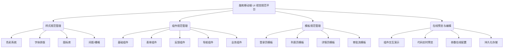

# 融和移动端 UI 视觉规范 - 产品架构文档

## 1. 业务架构

### 1.1 业务架构图

### 1.2 核心业务流程
1. **规范查阅流程**：用户访问首页 -> 选择规范分类（样式/组件/模板） -> 查看详细规约 -> 预览交互效果 -> 复制参考代码。
2. **规范编辑流程**（管理员）：进入编辑模式 -> 修改组件参数/文档 -> 实时预览变更 -> 提交保存 -> 数据同步至云端数据库。
3. **新组件接入流程**：定义组件结构 -> 编写 Vue 演示代码 -> 配置属性文档 -> 录入系统 -> 发布上线。

---

## 2. 功能模块划分

| 模块名称 | 功能子项 | 描述 |
| :--- | :--- | :--- |
| **基础样式模块** | 色彩管理 | 展示品牌色、辅助色、中性色板，支持 Hex/RGB 复制 |
| | 字体排版 | 定义标题、正文、辅助文字的字号、行高与字重 |
| | 图标管理 | 集成 Remix Icon 与自定义 SVG 图标，支持搜索与预览 |
| **组件库模块** | 组件导航 | 按功能分类（基础、表单、反馈等）的侧边导航栏 |
| | 组件详情 | 展示组件的视觉规范、交互说明、属性列表及使用场景 |
| | 代码示例 | 提供 Vue 3 + Vant 4 的标准实现代码，支持一键复制 |
| **预览演示模块** | 手机模拟器 | 375pt 基准尺寸的 iframe 容器，实时渲染组件交互 |
| | 交互演示 | 支持点击、输入、滑动等真实操作，验证组件行为 |
| **后台管理模块** | 在线编辑 | 此时支持对规范文案、代码片段的 CRUD 操作 |
| | 数据同步 | 与 MongoDB Atlas 保持实时同步，确保多端一致性 |

---

## 3. 用户角色定义

### 3.1 目标用户
- **UI/UX 设计师**：查阅视觉规范，确保设计稿符合统一标准；维护和更新设计令牌（Design Tokens）。
- **前端开发工程师**：查找组件代码片段，了解交互逻辑，快速复用现有组件；参与维护组件库代码。
- **产品经理**：了解现有组件能力，评估需求可行性；查阅业务模板，快速构建原型。

### 3.2 角色权限
| 角色 | 权限描述 |
| :--- | :--- |
| **访客 (Guest)** | 仅拥有**只读权限**。可浏览所有公开的规范文档、组件演示及代码示例。 |
| **管理员 (Admin)** | 拥有**读写权限**。需通过密钥验证（`Rong@123`），可编辑规范内容、修改代码示例并保存至数据库。 |

---

## 4. 版本历史
| 版本 | 日期 | 修改人 | 说明 |
| :--- | :--- | :--- | :--- |
| v1.0.0 | 2023-10-01 | Team | 初始版本上线，包含基础样式与核心组件 |
| v1.1.0 | 2023-11-15 | Team | 增加在线编辑与 MongoDB 集成功能 |
| v1.2.0 | 2024-03-05 | Trae AI | 补充搜索组件规范，完善文档架构 |
