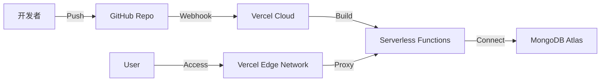

# 融和移动端 UI 视觉规范 - 技术文档

## 1. 系统架构

### 1.1 逻辑架构图
```mermaid
graph TD
    User[用户 (Dev/Design)] --> FE[前端应用 (Vue 3 + Vant 4)]
    FE --> API[API Gateway (Express)]
    API --> Service[业务逻辑层]
    Service --> DB[MongoDB Atlas]
    
    subgraph "前端模块"
        FE_Style[样式规范]
        FE_Component[组件库]
        FE_Editor[在线编辑器]
        FE_Preview[手机模拟器]
    end

    subgraph "后端服务"
        API_Auth[鉴权中间件]
        API_Data[数据同步]
        API_Static[静态资源托管]
    end
```

### 1.2 部署架构图


---

## 2. 技术栈选型

| 层级 | 技术 | 说明 |
| :--- | :--- | :--- |
| **前端框架** | Vue 3 (CDN) | 轻量级、渐进式框架，适合快速开发和组件化管理 |
| **UI 组件库** | Vant 4 | 有赞开源的移动端组件库，提供丰富的业务组件 |
| **CSS 框架** | Tailwind CSS | 原子化 CSS，提升样式编写效率 |
| **后端框架** | Express | Node.js 最流行的 Web 框架，提供 RESTful API 支持 |
| **数据库** | MongoDB Atlas | 云原生文档型数据库，适合存储非结构化的 JSON 配置 |
| **部署平台** | Vercel | 提供 Serverless 部署、CI/CD 自动化和全球 CDN 加速 |

---

## 3. 核心模块设计

### 3.1 数据模型 (Schema)

#### 3.1.1 Component (组件规范)
```javascript
const ComponentSchema = new mongoose.Schema({
  id: { type: String, required: true, unique: true }, // 组件唯一标识
  name: { type: String, required: true },             // 组件名称
  desc: { type: String },                             // 组件描述
  rules: [String],                                    // 设计规约列表
  demos: [{
    title: String,
    type: String, // 'vue', 'static', 'custom'
    code: String, // 源代码
    setupStr: String, // Vue setup 函数逻辑
    template: String  // Vue 模板
  }],
  updatedAt: { type: Date, default: Date.now }
});
```

#### 3.1.2 StyleConfig (样式配置)
```javascript
const StyleConfigSchema = new mongoose.Schema({
  colors: [{ name: String, hex: String, desc: String }],
  fonts: [{ name: String, size: String, weight: String }],
  spacings: [{ name: String, value: String }]
});
```

### 3.2 接口定义 (API)

| 方法 | 路径 | 描述 | 鉴权 |
| :--- | :--- | :--- | :--- |
| GET | `/api/components` | 获取所有组件规范数据 | 无 |
| GET | `/api/data` | 获取基础样式配置数据 | 无 |
| POST | `/api/components` | 更新组件规范数据 | 需要 |
| POST | `/api/data` | 更新基础样式配置数据 | 需要 |

**鉴权方式**：请求头需包含 `Authorization: Bearer <SECRET_KEY>`，密钥配置在环境变量 `API_SECRET` 中。

---

## 4. 安全策略
1. **API 鉴权**：写操作接口必须验证密钥，防止恶意篡改数据。
2. **CORS 策略**：配置允许跨域的域名白名单（如 Vercel 部署域名）。
3. **环境变量**：敏感信息（MongoDB URI, API Secret）存储在 `.env` 或 Vercel Environment Variables 中，不提交至代码仓库。
4. **数据备份**：利用 MongoDB Atlas 的自动备份功能，定期备份数据库快照。

---

## 5. 运维与监控
1. **日志监控**：通过 Vercel Logs 查看应用运行日志和报错信息。
2. **性能监控**：使用 Vercel Analytics 监控页面加载速度 (LCP, FID, CLS)。
3. **数据库监控**：通过 MongoDB Atlas Dashboard 查看连接数、读写吞吐量和磁盘使用率。

---

## 6. 部署流程
1. **代码提交**：开发者将代码推送到 GitHub `main` 分支。
2. **自动构建**：Vercel 监听到 Webhook，拉取最新代码并执行构建脚本。
3. **环境注入**：Vercel 注入生产环境变量。
4. **发布上线**：构建成功后自动切换流量至新版本，并更新 CDN 缓存。

---

## 7. 测试策略
1. **单元测试**：针对核心工具函数（如颜色转换、格式化）编写 Jest 测试用例。
2. **集成测试**：使用 Postman 或 Cypress 测试 API 接口的连通性和数据正确性。
3. **UI 测试**：人工在不同尺寸的模拟器和真实设备上验证组件的交互效果。
4. **回归测试**：每次发版前，手动验证关键路径（如首页加载、组件详情页跳转）。
